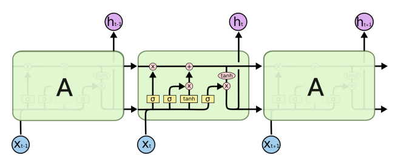

# Implementation of 2 layers LSTM by bisic Tensorflow functions

Fewer article explain LSTM in detail, here is a good one, [Understanding LSTM Networks](http://colah.github.io/posts/2015-08-Understanding-LSTMs/)

## LSTM structure
Here is the LSTM structure from colah:

## LSTM structure in more details
Even though I spend a lot of times to figure out some details, so here is the extended LSTM stucture.

## The shape of LSTM variables
**input**: (batch_size, num_input_features)  
**output, state, the 3 gates**: (batch_size, num_LSTM_nodes)  
**input weights** of the 3 gates and 1 update info: (num_input_features, num_LSTM_nodes)  
**output weights** of the 3 gates adn 1 update info: (num_LSTM_nodes, num_LSTM_nodes)  
**bias** of the 3 gates adn 1 update info: (1, num_LSTM_nodes)  

## LSTM more than 1 layer
Fot a 2 layers LSTM, take the output of one LSTM as input and feed into the 2nd layer LSTM, then the output of 2nd layer LSTM will feed into the Full connected networks.  
Notice that every LSTM has it's own state and output variables.

## Demonstration
I implement a demonstration ([6_lstm_2layers.py](L4-Deep-Models-for-Text-and-Sequences/6_lstm_2layers.py)) of a 2 layers LSTM using only basic Tensorflow functions. This code extends the 1 layer LSTM model from Udacity course [Deep Learning](https://classroom.udacity.com/courses/ud730)  
The Environment I running this program: Tensorflow 1.2, win10 64bit
